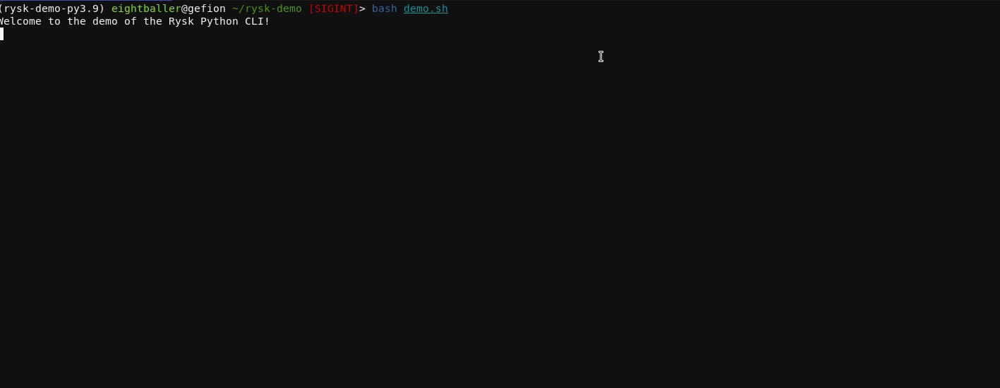

# Rysk Client

The rysk python client offers a programatic means by which to interact with the (Rysk Finance Protocol).

The DHV is a hybrid AMM and RFQ options protocol, generating uncorrelated returns for its liquidity providers whilst enabling anyone to trade (buy and sell) options with a wide range of strike prices and expiry dates. The DHV uses a dynamic approach in hedging risk to generate market-neutral uncorrelated returns for liquidity providers.

The Rysk client is a python client that allows users to interact with the [Rysk protocol](https://app.rysk.finance). The client is built on top of the web3.py and the [Open-Aea](https://github.com/valory-xyz/open-aea) python libraries. The client allows users to interact with the Rysk protocol in a programatic manner.


## Installation

The application is available on pypi and can be installed as so

```bash
pip install rysk-client
```

## Cli Tool

The application is also bundled as cli tool to allow users to interact with the protocol from the cli.





## Creating a Client 

Clients can be created from the rysk client module using python code.


```python
from rysk_client.client import RyskClient
from tests.conftest import DEFAULT_ADDRESS

auth = {
    "address": DEFAULT_ADDRESS,
}

client = RyskClient(**auth)
client

```

    {'address': '0x9B8a204636a7aa9c33053d9C3A828720d32212e8'}
    Rysk client initialized and connected to the blockchain at RPC connection https://arbitrum-goerli.rpc.thirdweb.com


    RyskClient(_markets=[], _tickers=[], _otokens={}, web3_client=<rysk_client.web3_client.Web3Client object at 0x7f1df5ff0670>)


### Markets
We can fetch data about the markets as so;


```python
markets = client.fetch_markets()
markets[0]
```


    {'id': 'ETH-29SEP23-1800-C',
     'strike': 1800.0,
     'expiration': 1695974400,
     'optionType': 'call',
     'active': True,
     'delta': 0.6189098962288028,
     'bid': 121.382234,
     'ask': 130.231078,
     'dhv': 0.1}


## Fetching Tickers

Tickers can be fetched from the client as so;


```python
tickers = client.fetch_tickers()
tickers[0]
```


    {'id': 'ETH-29SEP23-1800-C',
     'strike': 1800.0,
     'expiration': 1695974400,
     'optionType': 'call',
     'active': True,
     'delta': 0.6189098962288028,
     'bid': 121.382234,
     'ask': 130.231078,
     'dhv': 0.1}


## Fetching Positions
Positions are fetched from the client such that a user can retrieve their positions.

Positions are indicated by a vault id.

The vaultid iterates when a new position is created. 

Vaultid can be retrieved from;


```python
positions = client.fetch_positions()
positions[0]
```


    {'id': '0x9b8a204636a7aa9c33053d9c3a828720d32212e8-0x5c82b8d5a5306c48e9ac5fc07559a6961bd1ad1e-l-0',
     'symbol': 'ETH-29SEP23-1800-C',
     'timestamp': 1695974400000,
     'datetime': datetime.datetime(2023, 9, 29, 9, 0),
     'initialMarginPercentage': None,
     'realizedPnl': -0.9503399999999971,
     'unrealizedPnl': 0.0,
     'contractSize': 0.0,
     'side': 'long',
     'size': 0.0,
     'info': {'id': '0x9b8a204636a7aa9c33053d9c3a828720d32212e8-0x5c82b8d5a5306c48e9ac5fc07559a6961bd1ad1e-l-0',
      'netAmount': '0',
      'buyAmount': '200000000000000000',
      'sellAmount': '200000000000000000',
      'active': False,
      'realizedPnl': '-1150340',
      'oToken': {'id': '0x5c82b8d5a5306c48e9ac5fc07559a6961bd1ad1e',
       'symbol': 'oWETHUSDC/USDC-29SEP23-1800C',
       'expiryTimestamp': '1695974400',
       'strikePrice': '180000000000',
       'isPut': False,
       'underlyingAsset': {'id': '0x3b3a1de07439eeb04492fa64a889ee25a130cdd3'},
       'createdAt': '1689849479'},
      'redeemActions': [],
      'optionsBoughtTransactions': [{'amount': '100000000000000000',
        'premium': '12841201'},
       {'amount': '100000000000000000', 'premium': '13438848'}],
      'optionsSoldTransactions': [{'amount': '200000000000000000',
        'premium': '25329709'}],
      'expiration_datetime': datetime.datetime(2023, 9, 29, 9, 0),
      'strike': 1.8e+21,
      'isPut': False},
     'entryPrice': 0}


## Dev & Contributing

Dependencies are managed with poetry.

For dev build.

```bash
poetry install 
poetry shell 
```

# Tests


```python
!poetry run pytest tests
```

    ============================= test session starts ==============================
    platform linux -- Python 3.10.4, pytest-7.2.1, pluggy-1.2.0
    rootdir: /home/tom/Desktop/Fun/rysk/rysk_explorations, configfile: pytest.ini
    plugins: cov-3.0.0, web3-5.31.0, anyio-3.7.1, pylama-8.4.1, rerunfailures-11.1.2
    collected 78 items                                                             
    
    tests/test_client.py::test_fetch_markets PASSED                          [  1%]
    tests/test_client.py::test_fetch_tickers PASSED                          [  2%]
    tests/test_client.py::test_fetch_positions PASSED                        [  3%]
    tests/test_client.py::test_create_buy_order[ETH-28JUL23-1900-C] PASSED   [  5%]
    tests/test_client.py::test_create_buy_order[ETH-28JUL23-1900-P] PASSED   [  6%]
    tests/test_client.py::test_create_sell_order PASSED                      [  7%]
    tests/test_collateral.py::test_get_collateral[usdc] PASSED               [  8%]
    tests/test_collateral.py::test_get_collateral[weth] PASSED               [ 10%]
    tests/test_collateral.py::test_supported_collateral[usdc] PASSED         [ 11%]
    tests/test_collateral.py::test_supported_collateral[weth] PASSED         [ 12%]
    tests/test_collateral.py::test_unsupported_collateral[btc] PASSED        [ 14%]
    tests/test_collateral.py::test_unsupported_collateral[doge] PASSED       [ 15%]
    tests/test_contract_calls.py::test_local_fork PASSED                     [ 16%]
    tests/test_contract_calls.py::test_get_block_number PASSED               [ 17%]
    tests/test_contract_calls.py::test_settle_vault[6] SKIPPED (Pending ...) [ 19%]
    tests/test_contract_calls.py::test_settle_vault[9] SKIPPED (Pending ...) [ 20%]
    tests/test_contract_calls.py::test_settle_vault[15] SKIPPED (Pending...) [ 21%]
    tests/test_contract_calls.py::test_fails_to_settle_vault PASSED          [ 23%]
    tests/test_contract_calls.py::test_redeems_o_token SKIPPED (Pending ...) [ 24%]
    tests/test_contract_calls.py::test_retieve_and_redeem[ETH-02JUN23-1900-P-30] SKIPPED [ 25%]
    tests/test_contract_calls.py::test_retieve_and_redeem[ETH-09JUN23-1900-P-360] SKIPPED [ 26%]
    tests/test_contract_calls.py::test_redeem_market_from_str[ETH-02JUN23-1900-P] SKIPPED [ 28%]
    tests/test_contract_calls.py::test_client_can_buy[ETH-28JUL23-1900-C-5] PASSED [ 29%]
    tests/test_contract_calls.py::test_client_can_buy[ETH-28JUL23-2000-C-5] PASSED [ 30%]
    tests/test_contract_calls.py::test_client_can_buy[ETH-28JUL23-1800-P-5] PASSED [ 32%]
    tests/test_contract_calls.py::test_client_can_buy[ETH-28JUL23-1900-P-5] PASSED [ 33%]
    tests/test_contract_calls.py::test_client_can_buy_differing_amounts[ETH-28JUL23-2000-C-1] PASSED [ 34%]
    tests/test_contract_calls.py::test_client_can_buy_differing_amounts[ETH-28JUL23-1900-C-2] PASSED [ 35%]
    tests/test_contract_calls.py::test_client_can_buy_differing_amounts[ETH-28JUL23-1800-P-3] PASSED [ 37%]
    tests/test_contract_calls.py::test_client_can_buy_differing_amounts[ETH-28JUL23-2000-C-4] PASSED [ 38%]
    tests/test_contract_calls.py::test_client_can_buy_differing_amounts[ETH-28JUL23-1900-C-5] PASSED [ 39%]
    tests/test_contract_calls.py::test_client_can_buy_differing_amounts[ETH-28JUL23-1800-P-6] PASSED [ 41%]
    tests/test_contract_calls.py::test_client_can_buy_differing_amounts[ETH-28JUL23-2000-C-7] PASSED [ 42%]

## Formating and linting


```python
!make fmt lint
```

    poetry run black tests rysk_client && poetry run isort tests rysk_client 
    reformatted tests/conftest.py
    reformatted tests/test_rysk_option_market.py
    reformatted rysk_client/packages/eightballer/contracts/user_position_lens/contract.py
    reformatted rysk_client/src/utils.py
    reformatted rysk_client/src/operation_factory.py
    reformatted rysk_client/packages/eightballer/contracts/option_exchange/contract.py
    reformatted rysk_client/packages/eightballer/contracts/opyn_controller/contract.py
    reformatted rysk_client/packages/eightballer/contracts/opyn_option_registry/contract.py
    reformatted rysk_client/web3_client.py
    reformatted rysk_client/client.py
    
    All done! ✨ 🍰 ✨
    10 files reformatted, 39 files left unchanged.
    Fixing /home/tom/Desktop/Fun/rysk/rysk_explorations/tests/test_rysk_option_market.py
    Fixing /home/tom/Desktop/Fun/rysk/rysk_explorations/tests/conftest.py
    Fixing /home/tom/Desktop/Fun/rysk/rysk_explorations/rysk_client/client.py
    Fixing /home/tom/Desktop/Fun/rysk/rysk_explorations/rysk_client/web3_client.py
    Fixing /home/tom/Desktop/Fun/rysk/rysk_explorations/rysk_client/packages/eightballer/contracts/user_position_lens/contract.py
    Fixing /home/tom/Desktop/Fun/rysk/rysk_explorations/rysk_client/packages/eightballer/contracts/opyn_option_registry/contract.py
    Fixing /home/tom/Desktop/Fun/rysk/rysk_explorations/rysk_client/packages/eightballer/contracts/option_exchange/contract.py
    Fixing /home/tom/Desktop/Fun/rysk/rysk_explorations/rysk_client/packages/eightballer/contracts/opyn_controller/contract.py
    Fixing /home/tom/Desktop/Fun/rysk/rysk_explorations/rysk_client/src/operation_factory.py
    Fixing /home/tom/Desktop/Fun/rysk/rysk_explorations/rysk_client/src/utils.py
    Skipped 9 files
    poetry run adev -v -n 0 lint -p tests
    [19:16:04] DEBUG    Consider installing rusty-rlp to improve pyrlp   ]8;id=871982;file:///home/tom/.cache/pypoetry/virtualenvs/rysk-client-Q6-gVAE8-py3.10/lib/python3.10/site-packages/rlp/codec.py\codec.py]8;;\:]8;id=423867;file:///home/tom/.cache/pypoetry/virtualenvs/rysk-client-Q6-gVAE8-py3.10/lib/python3.10/site-packages/rlp/codec.py#26\26]8;;\
                        performance with a rust based backend                       
               INFO     Starting Auto Dev v0.2.6 ...                      ]8;id=777441;file:///home/tom/.cache/pypoetry/virtualenvs/rysk-client-Q6-gVAE8-py3.10/lib/python3.10/site-packages/auto_dev/base.py\base.py]8;;\:]8;id=390191;file:///home/tom/.cache/pypoetry/virtualenvs/rysk-client-Q6-gVAE8-py3.10/lib/python3.10/site-packages/auto_dev/base.py#72\72]8;;\
               INFO     Verbose mode enabled                              ]8;id=656669;file:///home/tom/.cache/pypoetry/virtualenvs/rysk-client-Q6-gVAE8-py3.10/lib/python3.10/site-packages/auto_dev/base.py\base.py]8;;\:]8;id=690015;file:///home/tom/.cache/pypoetry/virtualenvs/rysk-client-Q6-gVAE8-py3.10/lib/python3.10/site-packages/auto_dev/base.py#75\75]8;;\
               INFO     Using 32 processes for processing                 ]8;id=300635;file:///home/tom/.cache/pypoetry/virtualenvs/rysk-client-Q6-gVAE8-py3.10/lib/python3.10/site-packages/auto_dev/base.py\base.py]8;;\:]8;id=723439;file:///home/tom/.cache/pypoetry/virtualenvs/rysk-client-Q6-gVAE8-py3.10/lib/python3.10/site-packages/auto_dev/base.py#77\77]8;;\
               INFO     Setting log level to INFO                         ]8;id=59445;file:///home/tom/.cache/pypoetry/virtualenvs/rysk-client-Q6-gVAE8-py3.10/lib/python3.10/site-packages/auto_dev/base.py\base.py]8;;\:]8;id=408112;file:///home/tom/.cache/pypoetry/virtualenvs/rysk-client-Q6-gVAE8-py3.10/lib/python3.10/site-packages/auto_dev/base.py#79\79]8;;\
               INFO     Linting Open Autonomy Packages                    ]8;id=656444;file:///home/tom/.cache/pypoetry/virtualenvs/rysk-client-Q6-gVAE8-py3.10/lib/python3.10/site-packages/auto_dev/commands/lint.py\lint.py]8;;\:]8;id=861569;file:///home/tom/.cache/pypoetry/virtualenvs/rysk-client-Q6-gVAE8-py3.10/lib/python3.10/site-packages/auto_dev/commands/lint.py#37\37]8;;\
               INFO     Linting 12 files...                               ]8;id=422140;file:///home/tom/.cache/pypoetry/virtualenvs/rysk-client-Q6-gVAE8-py3.10/lib/python3.10/site-packages/auto_dev/commands/lint.py\lint.py]8;;\:]8;id=648455;file:///home/tom/.cache/pypoetry/virtualenvs/rysk-client-Q6-gVAE8-py3.10/lib/python3.10/site-packages/auto_dev/commands/lint.py#39\39]8;;\
    [19:16:09] INFO     Linting completed with 12 passed and 0 failed     ]8;id=16054;file:///home/tom/.cache/pypoetry/virtualenvs/rysk-client-Q6-gVAE8-py3.10/lib/python3.10/site-packages/auto_dev/commands/lint.py\lint.py]8;;\:]8;id=321483;file:///home/tom/.cache/pypoetry/virtualenvs/rysk-client-Q6-gVAE8-py3.10/lib/python3.10/site-packages/auto_dev/commands/lint.py#46\46]8;;\
    poetry run adev -v -n 0 lint -p rysk_client
    [19:16:10] DEBUG    Consider installing rusty-rlp to improve pyrlp   ]8;id=924141;file:///home/tom/.cache/pypoetry/virtualenvs/rysk-client-Q6-gVAE8-py3.10/lib/python3.10/site-packages/rlp/codec.py\codec.py]8;;\:]8;id=620693;file:///home/tom/.cache/pypoetry/virtualenvs/rysk-client-Q6-gVAE8-py3.10/lib/python3.10/site-packages/rlp/codec.py#26\26]8;;\
                        performance with a rust based backend                       
    [19:16:11] INFO     Starting Auto Dev v0.2.6 ...                      ]8;id=109749;file:///home/tom/.cache/pypoetry/virtualenvs/rysk-client-Q6-gVAE8-py3.10/lib/python3.10/site-packages/auto_dev/base.py\base.py]8;;\:]8;id=900199;file:///home/tom/.cache/pypoetry/virtualenvs/rysk-client-Q6-gVAE8-py3.10/lib/python3.10/site-packages/auto_dev/base.py#72\72]8;;\
               INFO     Verbose mode enabled                              ]8;id=607608;file:///home/tom/.cache/pypoetry/virtualenvs/rysk-client-Q6-gVAE8-py3.10/lib/python3.10/site-packages/auto_dev/base.py\base.py]8;;\:]8;id=519072;file:///home/tom/.cache/pypoetry/virtualenvs/rysk-client-Q6-gVAE8-py3.10/lib/python3.10/site-packages/auto_dev/base.py#75\75]8;;\
               INFO     Using 32 processes for processing                 ]8;id=302243;file:///home/tom/.cache/pypoetry/virtualenvs/rysk-client-Q6-gVAE8-py3.10/lib/python3.10/site-packages/auto_dev/base.py\base.py]8;;\:]8;id=356880;file:///home/tom/.cache/pypoetry/virtualenvs/rysk-client-Q6-gVAE8-py3.10/lib/python3.10/site-packages/auto_dev/base.py#77\77]8;;\
               INFO     Setting log level to INFO                         ]8;id=822518;file:///home/tom/.cache/pypoetry/virtualenvs/rysk-client-Q6-gVAE8-py3.10/lib/python3.10/site-packages/auto_dev/base.py\base.py]8;;\:]8;id=634619;file:///home/tom/.cache/pypoetry/virtualenvs/rysk-client-Q6-gVAE8-py3.10/lib/python3.10/site-packages/auto_dev/base.py#79\79]8;;\
               INFO     Linting Open Autonomy Packages                    ]8;id=550306;file:///home/tom/.cache/pypoetry/virtualenvs/rysk-client-Q6-gVAE8-py3.10/lib/python3.10/site-packages/auto_dev/commands/lint.py\lint.py]8;;\:]8;id=189039;file:///home/tom/.cache/pypoetry/virtualenvs/rysk-client-Q6-gVAE8-py3.10/lib/python3.10/site-packages/auto_dev/commands/lint.py#37\37]8;;\
               INFO     Linting 37 files...                               ]8;id=733237;file:///home/tom/.cache/pypoetry/virtualenvs/rysk-client-Q6-gVAE8-py3.10/lib/python3.10/site-packages/auto_dev/commands/lint.py\lint.py]8;;\:]8;id=406955;file:///home/tom/.cache/pypoetry/virtualenvs/rysk-client-Q6-gVAE8-py3.10/lib/python3.10/site-packages/auto_dev/commands/lint.py#39\39]8;;\
    [19:16:19] INFO     Linting completed with 37 passed and 0 failed     ]8;id=571940;file:///home/tom/.cache/pypoetry/virtualenvs/rysk-client-Q6-gVAE8-py3.10/lib/python3.10/site-packages/auto_dev/commands/lint.py\lint.py]8;;\:]8;id=671018;file:///home/tom/.cache/pypoetry/virtualenvs/rysk-client-Q6-gVAE8-py3.10/lib/python3.10/site-packages/auto_dev/commands/lint.py#46\46]8;;\


# Releasing
Git ops is used to enable automated releases via pypi.

```bash
export NEW_VERSION=0.2.11
git checkout -b v$NEW_VERSION &&
    bumpversion  rysk_client/ --new-version $NEW_VERSION && 
git push --set-upstream origin (git rev-parse --abbrev-ref HEAD) && git push --tag

```
